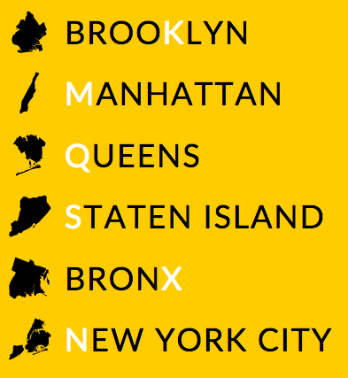

# BoroFace

An icon font of New York City boroughs. Modeled after ProPublica's [StateFace](http://propublica.github.io/stateface/).



# How to use it as a webfont

### Option 1: Manual

**Step 1:** Unzip `boroface.zip` and place the four files in the `webfont` subdirectory somewhere.

**Step 2:** Add the following CSS to your stylesheet, replacing `path/to/` with the correct path to the font files:

```CSS
@font-face {
    font-family: 'BoroFaceRegular';
    src: url('path/to/BoroFace-Regular-webfont.eot');
    src: url('path/to/BoroFace-Regular-webfont.eot?#iefix') format('embedded-opentype'),
         url('path/to/BoroFace-Regular-webfont.woff2') format('woff2'),
         url('path/to/BoroFace-Regular-webfont.woff') format('woff'),
         url('path/to/BoroFace-Regular-webfont.ttf') format('truetype'),
         url('path/to/BoroFace-Regular-webfont.svg#borofaceregular') format('svg');
    font-weight: normal;
    font-style: normal;
}
```

Anything with `font-family: 'BoroFaceRegular'` will now inherit the BoroFace font and you can insert icons by using the correct letter (see *Key* below).

```CSS
.boro {
    font-family: 'BoroFaceRegular';
}
```

```HTML
<div><span class="boro">K</span>Brooklyn</div>
<div><span class="boro">M</span>Manhattan</div>
<div><span class="boro">Q</span>Queens</div>
<div><span class="boro">S</span>Staten Island</div>
<div><span class="boro">X</span>Bronx</div>
<div><span class="boro">N</span>All of NYC</div>
```

### Option 2: Font Awesome-style


**Step 1:** Unzip `boroface.zip` and place the four files in the `webfont` subdirectory somewhere.

**Step 2:** Put `boroface.css` in the same directory as the four font files and include it as a stylesheet.

```HTML
<link rel="stylesheet" href="path/to/boroface.css"/>
```

You can now insert a state by using an empty tag with the `bf` class.

```HTML
<div><i class="bf bf-brooklyn"></i>Brooklyn</div>
<div><i class="bf bf-manhattan"></i>Manhattan</div>
<div><i class="bf bf-queens"></i>Queens</div>
<div><i class="bf bf-staten"></i>Staten Island</div>
<div><i class="bf bf-bronx"></i>Bronx</div>
<div><i class="bf bf-nyc"></i>All of NYC</div>
```

# Key

All letters are uppercase.

`K` - Brooklyn  
`M` - Manhattan  
`N` - New York City  
`Q` - Queens  
`S` - Staten Island  
`X` - Bronx  

# To do

Clean up Jamaica Bay and various small piers/channels.

# Credits/License

BoroFace was created by Noah Veltman for the [WNYC Data News Team](http://datanews.tumblr.com/).

Webfont assets were generated via [Font Squirrel](http://fontsquirrel.com/tools/webfont-generator).

Borough boundaries are from the [New York City Department of City Planning](http://www.nyc.gov/html/dcp/html/bytes/districts_download_metadata.shtml).

StateFace is Copyright (c) 2012, ProPublica  
BoroFace is Copyright (c) 2015, WNYC

Permission is hereby granted, free of charge, to any person obtaining a copy of this software and associated documentation files (the "Software"), to deal in the Software without restriction, including without limitation the rights to use, copy, modify, merge, publish, distribute, sublicense, and/or sell copies of the Software, and to permit persons to whom the Software is furnished to do so, subject to the following conditions:

The above copyright notice and this permission notice shall be included in all copies or substantial portions of the Software.

THE SOFTWARE IS PROVIDED "AS IS", WITHOUT WARRANTY OF ANY KIND, EXPRESS OR IMPLIED, INCLUDING BUT NOT LIMITED TO THE WARRANTIES OF MERCHANTABILITY, FITNESS FOR A PARTICULAR PURPOSE AND NONINFRINGEMENT. IN NO EVENT SHALL THE AUTHORS OR COPYRIGHT HOLDERS BE LIABLE FOR ANY CLAIM, DAMAGES OR OTHER LIABILITY, WHETHER IN AN ACTION OF CONTRACT, TORT OR OTHERWISE, ARISING FROM, OUT OF OR IN CONNECTION WITH THE SOFTWARE OR THE USE OR OTHER DEALINGS IN THE SOFTWARE.